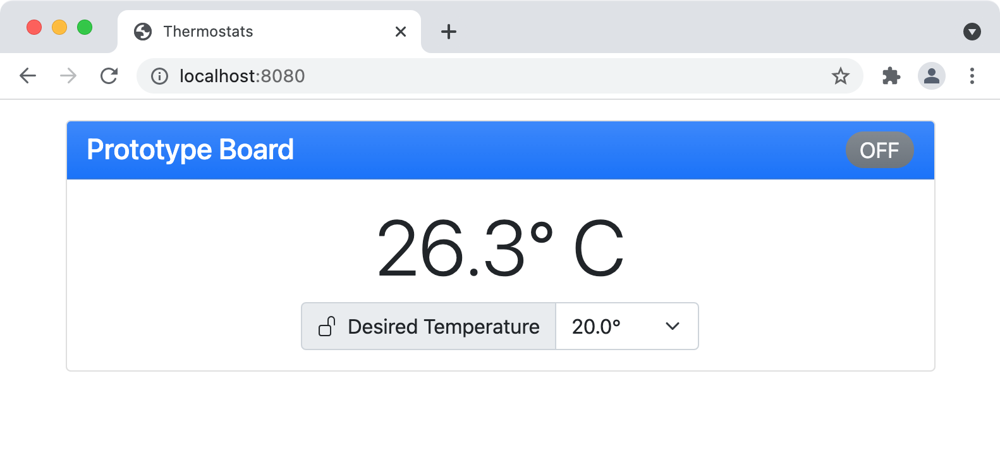

# Algorithms and Data Structure
My work in this category builds on the [previous category](../software-design-and-engineering) by creating a companion server component with a browser interface to remotely control the thermostat. While enhancing the artifact, I encountered some minor difficulties with the message payloads on the serial bus. Earlier testing with the console in the embedded programming environment did not expose the control characters present in the messages being emitted. Once I began to process the messages in the server component, I had to make a [minor adjustment to the embedded code](https://github.com/erik-mattheis-snhu/thermostat/commit/88bf2a56a947a88020134fe16791fd3a93d98f98#diff-0c35c7b82f65206df4bee94a5679d0060cc02dd7fdc104f070fc1b2546595745) to control the format of the message more carefully on the wire. This reinforced the idea that developing systems with interacting components can be an iterative process of development and testing and one must account for the possibility of updating components along the way.



To implement the server, I used well-known libraries and tools to assemble a solution, selecting appropriate data structures and developing algorithms to achieve the desired functionality without unnecessary complexity. The main components that showcase the objectives in this category are the [`ThermostatClient`](https://github.com/erik-mattheis-snhu/thermostat-server/blob/main/src/main/java/edu/snhu/erik/mattheis/thermostat/comm/ThermostatClient.java) and [`ThermostatManager`](https://github.com/erik-mattheis-snhu/thermostat-server/blob/main/src/main/java/edu/snhu/erik/mattheis/thermostat/comm/ThermostatManager.java) Java classes. The [`ThermostatClient`](https://github.com/erik-mattheis-snhu/thermostat-server/blob/main/src/main/java/edu/snhu/erik/mattheis/thermostat/comm/ThermostatClient.java) class implements functionality to interact with the thermostat hardware over the serial interface. It demonstrates the ability to adapt a data structure designed for use in the embedded system with a format more suitable for the server and browser interface using an iterative algorithm to parse the incoming message and populate values in an object model.

```Java
// convert bytes to ASCII string discarding the trailing line-feed
var bytes = event.getReceivedData();
var message = new String(bytes, 0, bytes.length - 1, US_ASCII);
log.info("received message from thermostat '{}': {}", thermostat.label, message);
Stream.of(message.split(","))       // split message into fields  - e.g. [ "key1:value1", "key2:value2" ]
      .map(part -> part.split(":")) // split field into key/value - e.g. [ "key1", "value1" ]
      .forEach(keyValue -> {
          switch (keyValue[0]) {
              case "D":
                  thermostat.desiredTemperature = Float.valueOf(keyValue[1]);
                  break;
              case "A":
                  thermostat.ambientTemperature = Float.valueOf(keyValue[1]);
                  break;
              case "H":
                  thermostat.heaterOn = "1".equals(keyValue[1]);
                  break;
              case "L":
                  thermostat.remoteUpdateDisabled = "1".equals(keyValue[1]);
                  break;
          }
      });
thermostat.lastUpdate = Instant.now();
```

The [`ThermostatManager`](https://github.com/erik-mattheis-snhu/thermostat-server/blob/main/src/main/java/edu/snhu/erik/mattheis/thermostat/comm/ThermostatManager.java) class demonstrates the use of a hash map data structure to maintain a set of thermostat connections and implements a blocking algorithm to control access to them.

```Java
clientLock.lock();
try {
    repository.listAll().forEach(thermostat -> {           // for all thermostats in the database...
        var client = thermostatClients.get(thermostat.id); // get the associated client
        if (client == null) {                              // if no client exists...
            try {                                          //     create a new one and connect to the thermostat
                var serialPort = SerialPort.getCommPort(thermostat.port);
                client = new ThermostatClient(serialPort, thermostat, repository);
                thermostatClients.put(thermostat.id, client);
                client.connect();
            } catch (Exception e) {
                log.error("problem connecting to thermostat '{}'", thermostat.label, e);
            }
        } else if (!client.isConnected()) {                 // else if the client is disconnected... 
            try {                                           //     try to reconnect to the thermostat
                client.connect();
            } catch (Exception e) {
                log.error("problem reconnecting thermostat '{}'", thermostat.label, e);
            }
        } else if (!upToDate(client.getThermostat())) {     // else if the thermostat is not up to date...
            try {                                           //     request an immediate update
                client.requestUpdate();
            } catch (Exception e) {
                log.error("problem updating thermostat '{}'", thermostat.label, e);
            }
        }
    });
} finally {
    clientLock.unlock();
}
```

I believe I also demonstrated the use of well-founded and innovate techniques by implementing a simple web interface using [proven](https://jquery.com) [browser technologies](https://getbootstrap.com) while selecting a [modern server framework](https://quarkus.io) that represents a leading-edge platform for cloud-based server implementations.

The complete source code for the server component including this enhancment is [available here](https://github.com/erik-mattheis-snhu/thermostat-server).

<hr />
<p align="center">
<span style="font-size: 80%; float: left; padding-bottom: 1em;">« <a href="../software-design-and-engineering">Software Design and Engineering</a> &nbsp;</span>
<span style="font-size: 80%; float: right; padding-bottom: 1em;">&nbsp; <a href="../databases">Databases</a> »</span>
</p>
