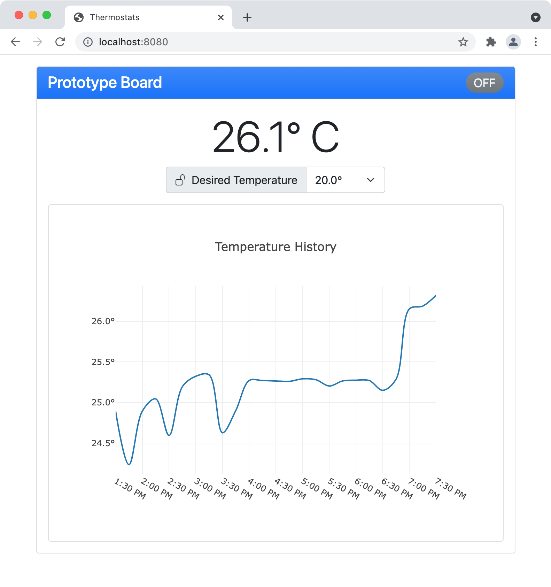

# Databases
My work in this category builds on the previous two categories by enhancing the server component to record temperature data to a time-series database and the browser interface to display a graph of recent temperature readings. While enhancing the artifact, I learned about the [time-series functionality in MongoDB](https://www.mongodb.com/time-series). I have previous experience with traditional collections in MongoDB from this computer science program and in my career, but I had not yet explored the new time-series support. Learning how to use the aggregation functionality to exploit the time-series storage format was challenging, but interesting. I also explored the use of the [Plotly JavaScript library](https://plotly.com/javascript/) for presenting graphs in the browser which I had not used previously. It was challenging to find an optimal data format for returning historical temperature data in a format directly suitable for the graphing library.



Building on the MongoDB database I used for the initial server implementation, I created a new collection using the time-series support found in the latest MongoDB release. This feature optimizes the collection for the storage of timed measurements and is well-suited to capturing temperature measurements in real time. The time-series collection works in conjunction with the aggregation facilities in MongoDB to allow for [efficient reporting of historical data](https://github.com/erik-mattheis-snhu/thermostat-server/blob/9642e53c527c66bcce682ea0373a43abaf68df1c/src/main/java/edu/snhu/erik/mattheis/thermostat/db/TemperatureRepository.java#L55-L113).

```Java
/**
 * queries aggregated temperature history from the time-series collection in MongoDB
 * using average temperatures over 15 minute intervals
 * 
 * @param thermostatId the ID of the thermostat to report on
 * @param from the start fo the time period to report on
 * @param to the end of the time period to report on
 * @return the aggregated results in a format suitable for graphing on the front-end 
 */
public TemperatureHistory getTemperatureHistory(String thermostatId, Instant from, Instant to) {
    var unit = "minute";
    var binSize = 15;
    /*
     * match all documents for the given thermostatId within the time period
     * 
     * { $match: { $and: [ { $eq:  [ "thermostatId", thermostatId ] },
     *                     { $gte: [ "timestamp",    from         ] },
     *                     { $lt:  [ "timestamp",    to           ] } ] } }
     */
    var match = match(and(eq("thermostatId", thermostatId), gte("timestamp", from), lt("timestamp", to)));
    /*
     * exclude the _id field, include termparature and round timestamp up to the next 15 minute boundary
     * 
     * { $project: { _id: 0,
     *               temperature: 1,
     *               timestamp: {
     *                   $dateAdd: {
     *                       startDate: {
     *                           $dateTrunc: {
     *                               date: "$timestamp",
     *                               unit: "minute",
     *                               binSize: 15
     *                           },
     *                       },
     *                       unit: "minute",
     *                       amount: 15
     *                   }
     *               } } }
     */
    var project = project(fields(excludeId(), include("temperature"), computed("timestamp", computed("$dateAdd",
            new BasicDBObject("startDate", computed("$dateTrunc",
                    new BasicDBObject("date", "$timestamp").append("unit", unit).append("binSize", binSize)))
                            .append("unit", unit).append("amount", binSize)))));
    /*
     * average all temperatures from the same 15 minute interval
     * 
     * { $group: { _id: "$timestamp",
     *             temperature: { $avg: "$temperature" } } }
     */
    var group = group("$timestamp", avg("temperature", "$temperature"));
    /*
     * sort by _id (timestamp)
     * 
     * { $sort: { _id: 1 } }
     */
    var sort = sort(include("_id"));
    var documents = mongoCollection().aggregate(List.of(match, project, group, sort), Document.class);
    return TemperatureHistory.of(documents, "_id", "temperature");
}
```

With the new collection in place, I updated the server to record temperature readings whenever a change is sent from the thermostat and to request an update from the thermostat whenever a minute goes by without a change. Then I updated the web interface to show a graph of the recent temperature changes by dynamically querying the database for the average temperature recorded for 15-minute periods.

The complete source code for the server component including this enhancment is [available here](https://github.com/erik-mattheis-snhu/thermostat-server).

<hr />
<p align="center">
<span style="font-size: 80%; float: left; padding-bottom: 1em;">« <a href="../algorithms-and-data-structure">Algorithms and Data Structure</a> &nbsp;</span>
</p>
