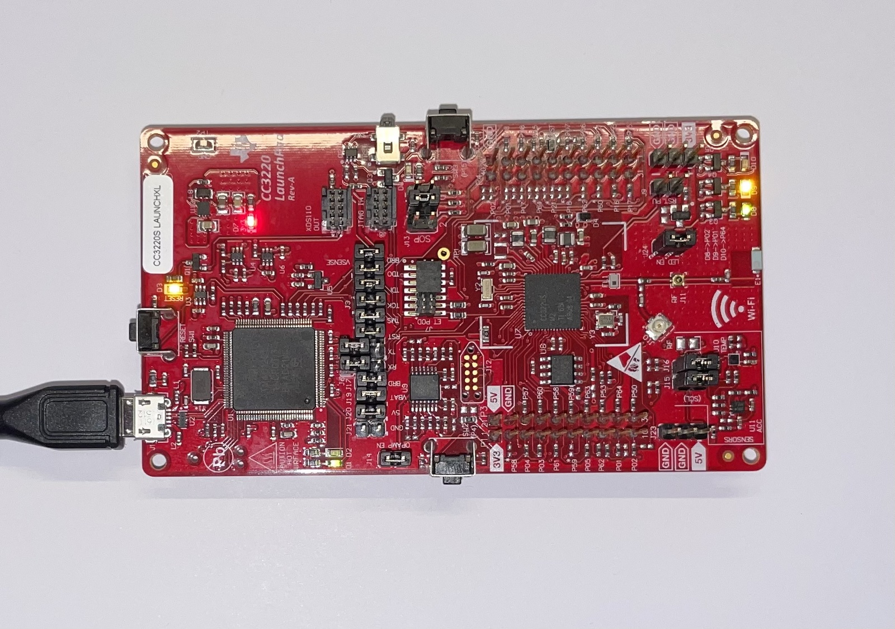

# Software Design and Engineering
The artifact forming the basis of my work for in this category is my final project for CS-350. The project involved programming an [embedded microcontroller](https://www.ti.com/tool/CC3220S-LAUNCHXL) to simulate a network-connected thermostat. I created this artifact in June of 2021 as part of the 21EW5 term.



I decided to include this artifact in my portfolio because it represents technology that I had not previously worked with and required skills related to the [Internet of Things](https://www.zdnet.com/article/what-is-the-internet-of-things-everything-you-need-to-know-about-the-iot-right-now/). I believe the IoT will not only increase demand for software engineers in general, but also increase the value of embedded programming skills. Including this artifact in my portfolio showcases my skills across a wider variety of platforms. I improved the artifact from its original form by cleaning up the code based on the initial code review and implementing the ability for a server component to control the thermostat remotely. I also took the opportunity to increase the accuracy of the measurements and provide some safeguards against extreme temperature selections.

As I worked through the enhancement process, I learned more about the embedded development board used for the CS-350 project. By approaching the project with enhancement in mind (instead of just meeting the requirements of the CS-350 final project) I discovered a lot of room for improvement. My main challenge was budgeting my time and sticking to the original plan as new ideas occurred to me throughout the process. I started with a basic reorganization and reformatting of the code to make it more consistent and easier to manage. A significant part of the original project came from a project template, so I took the time to replace that code with my own and remove a lot of unnecessary functionality used for debugging, resulting in more efficient and stable execution.

The principal improvement I made to the artifact was to introduce the ability to [receive commands from the server](https://github.com/erik-mattheis-snhu/thermostat/blob/88bf2a56a947a88020134fe16791fd3a93d98f98/thermostat.c#L288-L316).

```C
/*
 * parse the server input buffer for supported actions
 *
 * supported actions include a single 'U' character indicating an update request
 * or a command to set the desired temperature in the form:
 *
 *   D:25.000000
 *
 * return true if state should be sent to the server
 */
bool handleServerInput() {
    size_t len = strlen(serverInput);


    if (len > 0) {
        switch (serverInput[0]) {
            case 'U': // update request
                return true;
            case 'D': // set desired temperature
                if (len > 2 && serverInput[1] == ':' && !preventRemoteSet) { // ensure buffer is long enough and remote set is not disallowed
                    float temperature;
                    if (sscanf(&serverInput[2], "%f", &temperature)) { // if a float was successfully parse
                        return setDesiredTemperature(temperature);     // set the desired temperature
                    }
                }
        }
    }


    return false;
}
```

I also [updated the format used to send data to the server](https://github.com/erik-mattheis-snhu/thermostat/blob/88bf2a56a947a88020134fe16791fd3a93d98f98/thermostat.c#L271-L286), making it simpler to parse and to support floating-point values.

```C
/*
 * write the current state to the server in the following format:
 *
 *   D:20.000000,A:25.187500,H:0,L:0
 *
 * where the fields are as follows:
 *
 *   D: desired temperature (degrees C)
 *   A: ambient temperature (degrees C)
 *   H: heater state (0 = off, 1 = on)
 *   L: remote lock (0 = off, 1 = on)
 */
void sendStateToServer() {
    int len = snprintf(serverOutput, 64, "D:%f,A:%f,H:%d,L:%d\n", desiredTemperature, ambientTemperature, heaterState, preventRemoteSet);
    UART_write(uart, &serverOutput, len);
}
```

After my enhancements, the thermostat can respond to a server request for an immediate update as well as a request to set the desired temperature directly. This enabled the use of the browser-based interface which I developed for the algorithms and data structure enhancement. While implementing this functionality, I recognized the potential for misuse and added a feature for locking the thermostat to disallow setting the temperature remotely. Another major enhancement I made was to [coalesce the logic into a single timing interval](https://github.com/erik-mattheis-snhu/thermostat/blob/88bf2a56a947a88020134fe16791fd3a93d98f98/thermostat.c#L367-L403).

```C
while(1) { // loop forever
    while (!timerFlag); // wait for timer flag to be raised
    bool stateChanged = false;
    if (serverInputFlag) {                   // if server input flag was raised
        stateChanged |= handleServerInput(); // handle input and set state change indicator accordingly
        serverInputFlag = false;             // lower flag
        readFromServer();                    // request next line from server
    }
    if (downButtonFlag && upButtonFlag) {      // if both down and up button flags were raised
        preventRemoteSet = !preventRemoteSet;  // toggle remote temperature lock
        downButtonFlag = upButtonFlag = false; // lower both flags
        stateChanged = true;
    } else if (downButtonFlag) {                      // if down button flag was raised
        stateChanged |= decreaseDesiredTemperature(); // decrease desired temperature and set state change indicator accordingly
        downButtonFlag = false;                       // lower flag


    } else if (upButtonFlag) {                        // if up button flag was raised
        stateChanged |= increaseDesiredTemperature(); // increase desired temperature and set state change indicator accordingly
        upButtonFlag = false;                         // lower flag
    }
    if (temperatureFlag) {                                                  // if temperature flag was raised
        ambientTemperature = temperatureReading * TEMP_SENSOR_RESOLUTION_C; // multiply temperature reading by sensor resolution to set ambient temperature
        temperatureFlag = false;                                            // lower flag
        firstTempReceived = true;
        stateChanged = true;
    }
    if (ambientTemperature < desiredTemperature) {        // if ambient temperature is less than desired temperature
        stateChanged |= setHeaterState(HEATER_ON);        // make sure heater is on and set state change indicator accordingly
    } else if (ambientTemperature > desiredTemperature) { // if ambient temperature is greater than desired temperature
        stateChanged |= setHeaterState(HEATER_OFF);       // make sure heater is off and set state change indicator accordingly
    }
    if (firstTempReceived && stateChanged) { // if a temperature reading has been made and state has changed
        sendStateToServer();                 // send state to server
    }
    requestTemperature(); // request a temperature reading
    timerFlag = false;    // lower the flag and execute the loop again
}
```

The CS-350 final was designed to show the ability to use a single timer to drive several processes occurring on different intervals. For the thermostat implementation, it is more efficient to use a common interval for the main run loop, saving memory and reducing code complexity. I made several smaller enhancements, including storing temperatures as floating-point values for greater precision and enforcing minimum and maximum temperature settings. After implementing the enhancements, I made sure the code was well-documented as easy to follow.

The complete source code for this enhancment is [available here](https://github.com/erik-mattheis-snhu/thermostat).

<hr />
<p align="center">
<span style="font-size: 80%; float: left; padding-bottom: 1em;">« <a href="../code-review">Code Review</a> &nbsp;</span>
<span style="font-size: 80%; float: right; padding-bottom: 1em;">&nbsp; <a href="../algorithms-and-data-structure">Algorithms and Data Structure</a> »</span>
</p>
